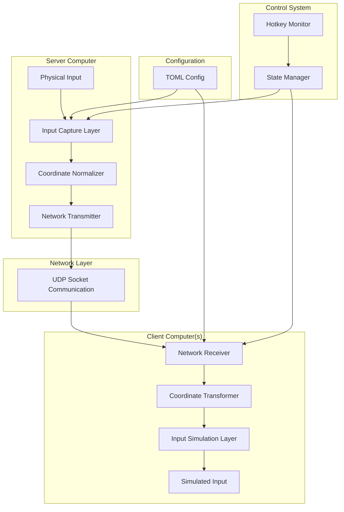

# Design Document: InputFlow Cross-Platform Input Sharing

## Overview

InputFlow is a lightweight, high-performance Python application that enables seamless keyboard and mouse sharing across multiple computers through network communication. The system uses a client-server architecture with UDP-based communication to minimize latency while supporting Windows, macOS, and Linux (including Hyprland/Wayland) platforms.

The core design philosophy emphasizes simplicity, performance, and cross-platform compatibility. The system automatically adapts its input capture and simulation methods based on the detected operating system, ensuring optimal performance on each platform.

## Architecture

### High-Level Architecture



### Component Interaction Flow

1. **Input Capture**: Physical input events are captured using platform-specific libraries
2. **Coordinate Normalization**: Absolute coordinates are converted to normalized (0.0-1.0) values
3. **Network Transmission**: Events are serialized and transmitted via UDP
4. **Network Reception**: Client receives and deserializes event packets
5. **Coordinate Transformation**: Normalized coordinates are converted to target screen coordinates
6. **Input Simulation**: Events are simulated on the target system using platform-specific APIs

## Components and Interfaces

### 1. Input Capture Layer

**Purpose**: Capture physical keyboard and mouse events from the operating system.

**Platform-Specific Implementations**:
- **Windows/macOS**: Uses `pynput` library for unified cross-platform support
- **Linux (Hyprland/Wayland)**: Uses `evdev` for direct kernel-level event capture

**Interface**:
```python
class InputCapture:
    def start_monitoring(self) -> None
    def stop_monitoring(self) -> None
    def on_mouse_move(self, x: int, y: int) -> None
    def on_mouse_click(self, button: MouseButton, pressed: bool) -> None
    def on_mouse_scroll(self, dx: int, dy: int) -> None
    def on_key_event(self, key: Key, pressed: bool) -> None
```

### 2. Input Simulation Layer

**Purpose**: Simulate keyboard and mouse events on client systems.

**Platform-Specific Implementations**:
- **Windows/macOS**: Uses `pynput.Controller` classes
- **Linux (Hyprland/Wayland)**: Uses `uinput` for virtual device creation

**Interface**:
```python
class InputSimulation:
    def move_mouse(self, x: int, y: int) -> None
    def click_mouse(self, button: MouseButton, pressed: bool) -> None
    def scroll_mouse(self, dx: int, dy: int) -> None
    def press_key(self, key: Key, pressed: bool) -> None
```

### 3. Network Communication Layer

**Purpose**: Handle UDP-based communication between server and clients.

**Key Features**:
- Low-latency UDP protocol
- Binary packet serialization for efficiency
- Configurable IP binding and port settings

**Interface**:
```python
class NetworkServer:
    def bind(self, ip: str, port: int) -> None
    def send_event(self, event: InputEvent, target_ip: str) -> None
    def close(self) -> None

class NetworkClient:
    def connect(self, server_ip: str, port: int) -> None
    def receive_events(self) -> Iterator[InputEvent]
    def close(self) -> None
```

### 4. Coordinate Transformation System

**Purpose**: Convert between absolute pixel coordinates and normalized coordinates for cross-resolution compatibility.

**Key Features**:
- Bidirectional coordinate conversion
- Screen resolution detection
- Scaling factor handling

**Interface**:
```python
class CoordinateTransformer:
    def normalize_coordinates(self, x: int, y: int, screen_width: int, screen_height: int) -> Tuple[float, float]
    def denormalize_coordinates(self, norm_x: float, norm_y: float, screen_width: int, screen_height: int) -> Tuple[int, int]
    def get_screen_dimensions(self) -> Tuple[int, int]
```

### 5. Topology Manager

**Purpose**: Manage screen relationships and handle edge-based screen switching.

**Key Features**:
- TOML-based topology configuration
- Edge detection and switching logic
- Multi-directional screen relationships

**Interface**:
```python
class TopologyManager:
    def load_topology(self, config_path: str) -> None
    def get_target_for_direction(self, direction: Direction) -> Optional[str]
    def is_at_edge(self, x: int, y: int, direction: Direction) -> bool
    def should_switch_screen(self, x: int, y: int) -> Optional[str]
```

### 6. Configuration Manager

**Purpose**: Load and validate TOML configuration files.

**Interface**:
```python
class ConfigManager:
    def load_config(self, path: str) -> Config
    def validate_config(self, config: Config) -> bool
    def get_network_config(self) -> NetworkConfig
    def get_topology_config(self) -> TopologyConfig
    def get_hotkey_config(self) -> HotkeyConfig
```

### 7. Hotkey Controller

**Purpose**: Handle global hotkeys for system control.

**Interface**:
```python
class HotkeyController:
    def register_hotkeys(self, hotkeys: Dict[str, Callable]) -> None
    def toggle_lock_mode(self) -> None
    def cycle_screens(self) -> None
    def is_locked(self) -> bool
```

## Data Models

### Event Data Structures

```python
@dataclass
class MouseMoveEvent:
    normalized_x: float
    normalized_y: float
    timestamp: float

@dataclass
class MouseClickEvent:
    button: MouseButton
    pressed: bool
    normalized_x: float
    normalized_y: float
    timestamp: float

@dataclass
class MouseScrollEvent:
    delta_x: int
    delta_y: int
    timestamp: float

@dataclass
class KeyboardEvent:
    key_code: int
    pressed: bool
    timestamp: float

@dataclass
class InputEvent:
    event_type: EventType
    data: Union[MouseMoveEvent, MouseClickEvent, MouseScrollEvent, KeyboardEvent]
```

### Configuration Data Structures

```python
@dataclass
class NetworkConfig:
    role: str  # "server" or "client"
    bind_ip: str
    port: int
    tcp_nodelay: bool

@dataclass
class TopologyEntry:
    self_ip: str
    left: Optional[str]
    right: Optional[str]
    up: Optional[str]
    down: Optional[str]

@dataclass
class HotkeyConfig:
    switch_lock: str
    switch_loop_between_screens: str

@dataclass
class Config:
    network: NetworkConfig
    topology: List[TopologyEntry]
    shortcuts: HotkeyConfig
```

## Correctness Properties

*A property is a characteristic or behavior that should hold true across all valid executions of a system-essentially, a formal statement about what the system should do. Properties serve as the bridge between human-readable specifications and machine-verifiable correctness guarantees.*

Now I need to analyze the acceptance criteria to determine which ones can be tested as properties:

Based on the prework analysis, the following properties ensure system correctness:

### Property 1: Coordinate Normalization Round-Trip
*For any* screen resolution and pixel coordinates within screen bounds, converting to normalized coordinates and back should preserve the original position within acceptable precision tolerance.
**Validates: Requirements 7.1, 7.2, 7.4, 7.5**

### Property 2: Input Event Capture Completeness
*For any* supported input event type (mouse movement, clicks, scroll, keyboard), the system should successfully capture and process the event regardless of the specific input device.
**Validates: Requirements 4.1, 4.2, 4.3, 4.4**

### Property 3: Network Event Transmission Integrity
*For any* captured input event, the event transmitted over the network should contain the same essential information as the original event when deserialized on the client side.
**Validates: Requirements 1.2, 4.1, 4.2, 4.3, 4.4**

### Property 4: Platform-Specific Library Selection
*For any* detected operating system, the system should select the appropriate input capture and simulation libraries as specified in the requirements.
**Validates: Requirements 2.4**

### Property 5: Configuration Validation Completeness
*For any* valid TOML configuration file, all required configuration sections (network, topology, shortcuts) should be successfully parsed and validated.
**Validates: Requirements 6.2, 6.3, 6.4, 6.5**

### Property 6: Edge Detection Accuracy
*For any* mouse position and screen configuration, edge detection should correctly identify when the mouse reaches a configured screen boundary and determine the appropriate target screen.
**Validates: Requirements 3.3**

### Property 7: Hotkey State Management
*For any* configured hotkey combination, pressing the hotkey should correctly toggle the associated system state (lock mode or screen cycling).
**Validates: Requirements 5.1, 5.2**

### Property 8: Coordinate Normalization Range
*For any* input coordinates from any screen resolution, the normalized coordinates should always be within the range [0.0, 1.0].
**Validates: Requirements 1.4, 3.5**

### Property 9: Throttling Effectiveness
*For any* sequence of high-frequency mouse movement events, the throttling mechanism should reduce the transmission rate while preserving movement accuracy.
**Validates: Requirements 4.5**

### Property 10: Lock Mode Prevention
*For any* mouse position when lock mode is active, automatic screen switching should be prevented regardless of edge proximity.
**Validates: Requirements 5.5**

## Error Handling

### Network Communication Errors
- **Connection Failures**: Graceful handling of network unavailability with retry mechanisms
- **Packet Loss**: UDP packet loss tolerance without system crashes
- **Invalid Packets**: Malformed packet detection and rejection

### Input System Errors
- **Permission Errors**: Clear error messages for insufficient Linux device permissions
- **Device Unavailability**: Handling of missing or inaccessible input devices
- **Platform Detection Failures**: Fallback mechanisms for unknown platforms

### Configuration Errors
- **Missing Configuration**: Default configuration generation when config.toml is absent
- **Invalid Configuration**: Detailed validation error messages with correction suggestions
- **Malformed TOML**: Clear parsing error messages with line number information

### Runtime Errors
- **Memory Constraints**: Efficient memory usage with event queue size limits
- **CPU Overload**: Performance monitoring and automatic throttling adjustments
- **System Resource Conflicts**: Detection and resolution of input device conflicts

## Testing Strategy

### Dual Testing Approach

The testing strategy employs both unit tests and property-based tests to ensure comprehensive coverage:

**Unit Tests**: Focus on specific examples, edge cases, and error conditions including:
- Configuration file parsing with various TOML formats
- Platform detection with mocked system environments
- Network socket creation and binding
- Error handling scenarios with invalid inputs
- Integration points between system components

**Property-Based Tests**: Verify universal properties across all inputs including:
- Coordinate transformation accuracy across all screen resolutions
- Event capture completeness for all input types
- Network transmission integrity for all event data
- Configuration validation for all valid TOML structures
- Edge detection accuracy for all mouse positions and screen layouts

### Property-Based Testing Configuration

- **Testing Library**: Use `hypothesis` for Python property-based testing
- **Test Iterations**: Minimum 100 iterations per property test to ensure statistical confidence
- **Test Tagging**: Each property test tagged with format: **Feature: input-sharing, Property {number}: {property_text}**
- **Coverage Requirements**: Each correctness property implemented by exactly one property-based test
- **Randomization**: Comprehensive input space coverage through intelligent test data generation

### Testing Framework Integration

- **Unit Testing**: Use `pytest` for unit test execution and reporting
- **Property Testing**: Use `hypothesis` with `pytest` integration for property-based tests
- **Mocking**: Use `unittest.mock` for platform-specific behavior simulation
- **Coverage**: Use `pytest-cov` for code coverage analysis and reporting

### Test Data Generation Strategy

**Smart Generators**: Create intelligent test data generators that:
- Generate valid screen resolutions and coordinate ranges
- Create realistic input event sequences
- Produce valid and invalid TOML configuration variations
- Generate network packet data with various payload sizes
- Create mouse movement patterns that test edge detection logic

**Edge Case Coverage**: Ensure generators include:
- Boundary values for coordinates and screen dimensions
- Empty and malformed configuration files
- Network timeout and failure scenarios
- High-frequency input event sequences
- Platform-specific permission and access scenarios