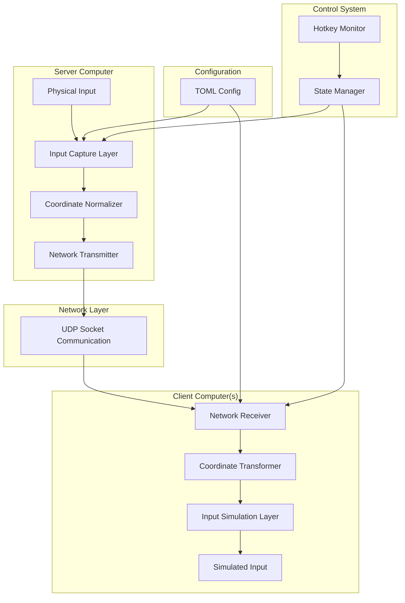

# Design Document: InputFlow Cross-Platform Input Sharing

## Overview

InputFlow is a lightweight, high-performance Python application that enables seamless keyboard and mouse sharing across multiple computers through network communication. The system uses a client-server architecture with UDP-based communication to minimize latency while supporting Windows, macOS, and Linux (including Hyprland/Wayland) platforms.

The core design philosophy emphasizes simplicity, performance, and cross-platform compatibility. The system automatically adapts its input capture and simulation methods based on the detected operating system, ensuring optimal performance on each platform.

## Architecture

### High-Level Architecture



### Component Interaction Flow

1. **Input Capture**: Physical input events are captured using platform-specific libraries
2. **Coordinate Normalization**: Absolute coordinates are converted to normalized (0.0-1.0) values
3. **Network Transmission**: Events are serialized and transmitted via UDP
4. **Network Reception**: Client receives and deserializes event packets
5. **Coordinate Transformation**: Normalized coordinates are converted to target screen coordinates
6. **Input Simulation**: Events are simulated on the target system using platform-specific APIs

## Components and Interfaces

### 1. Input Capture Layer

**Purpose**: Capture physical keyboard and mouse events from the operating system.

**Platform-Specific Implementations**:
- **Windows/macOS**: Uses `pynput` library for unified cross-platform support
- **Linux (Hyprland/Wayland)**: Uses `evdev` for direct kernel-level event capture

**Interface**:
```python
class InputCapture:
    def start_monitoring(self) -> None
    def stop_monitoring(self) -> None
    def on_key_event(self, key: int | Key, pressed: bool) -> None
    def on_mouse_click(self, button: int | Button, pressed: bool) -> None
    def on_mouse_move(self, x: int, y: int) -> None
    def on_mouse_scroll(self, dx: int, dy: int) -> None
```

### 2. Input Simulation Layer

**Purpose**: Simulate keyboard and mouse events on client systems.

**Platform-Specific Implementations**:
- **Windows/macOS**: Uses `pynput.Controller` classes
- **Linux (Hyprland/Wayland)**: Uses `uinput` for virtual device creation

**Interface**:
```python
class InputSimulation:
    def move_mouse_abs(self, x: int, y: int) -> None
    def move_mouse_rel(self, dx: int, dy: int) -> None
    def click_mouse(self, button: int | Button, pressed: bool) -> None
    def scroll_mouse(self, dx: int, dy: int) -> None
    def click_key(self, key: int | Key, pressed: bool) -> None
    def replay_event(self, event: InputEvent) -> None
    def hotkey(self, *key_strs:str):
```

### 3. Network Communication Layer

**Purpose**: Handle UDP-based communication between server and clients.

**Key Features**:
- Low-latency zmq
- Binary packet serialization for efficiency
- Configurable IP binding and port settings

**Interface**:
```python
class NetworkServer:
    def bind(self, ip: str, port: int) -> None
    def send_event(self, event: InputEvent, target_ip: str) -> None
    def close(self) -> None

class NetworkClient:
    def connect(self, server_ip: str, port: int) -> None
    def receive_events(self) -> Iterator[InputEvent]
    def close(self) -> None
```

### 4. Coordinate Transformation System

**Purpose**: Convert between absolute pixel coordinates and normalized coordinates for cross-resolution compatibility.

**Key Features**:
- Bidirectional coordinate conversion
- Screen resolution detection
- Scaling factor handling

**Interface**:
```python
class CoordinateTransformer:
    def normalize(self, x: int, y: int) -> Tuple[float, float]
    def denormalize(self, norm_x: float, norm_y: float) -> Tuple[int, int]
    def get_screen_dimensions(self) -> Tuple[int, int]
```

### 5. Topology Manager

**Purpose**: Manage screen relationships and handle edge-based screen switching.

**Key Features**:
- TOML-based topology configuration
- Edge detection and switching logic
- Multi-directional screen relationships

**Interface**:
```python
class TopologyManager:
    def load_topology(self, config_path: str) -> None
    def get_target_for_direction(self, direction: Direction) -> Optional[str]
    def is_at_edge(self, x: int, y: int, direction: Direction) -> bool
    def should_switch_screen(self, x: int, y: int) -> Optional[str]
```

### 6. Configuration Manager

**Purpose**: Load and validate TOML configuration files.

**Interface**:
```python
class ConfigManager:
    def load_config(self, config_path: str) -> Config
    def _parse_and_validate(self, toml_data: dict) -> Config
```

### 7. Hotkey Controller

**Purpose**: Handle global hotkeys for system control.

**Interface**:
```python
class HotkeyController:
    def register_hotkeys(self, hotkeys: Dict[str, Callable]) -> None
    def toggle_lock_mode(self) -> None
    def cycle_screens(self) -> None
    def is_locked(self) -> bool
```

## Data Models

### Event Data Structures

```python
@dataclass
class MouseMoveEvent:
    normalized_x: float
    normalized_y: float

@dataclass
class MouseClickEvent:
    button: int | Button
    pressed: bool
    normalized_x: float
    normalized_y: float

@dataclass
class MouseScrollEvent:
    delta_x: int
    delta_y: int

@dataclass
class KeyboardEvent:
    key_code: int | Key
    pressed: bool

@dataclass
class InputEvent:
    event_type: EventType
    data: MouseMoveEvent | MouseClickEvent | MouseScrollEvent | KeyboardEvent
```

### Configuration Data Structures

```python
@dataclass
class NetworkConfig:
    role: str  # "server" or "client"
    bind_ip: str
    port: int
    tcp_nodelay: bool

@dataclass
class TopologyEntry:
    self_ip: str
    left: Optional[str]
    right: Optional[str]
    up: Optional[str]
    down: Optional[str]

@dataclass
class HotkeyConfig:
    switch_lock: str
    switch_loop_between_screens: str

@dataclass
class Config:
    network: NetworkConfig
    topology: List[TopologyEntry]
    shortcuts: HotkeyConfig
```